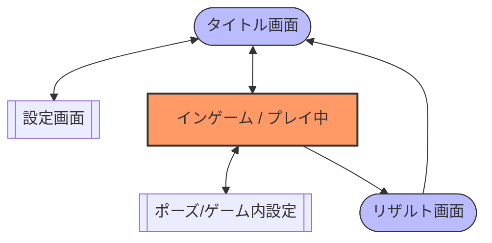
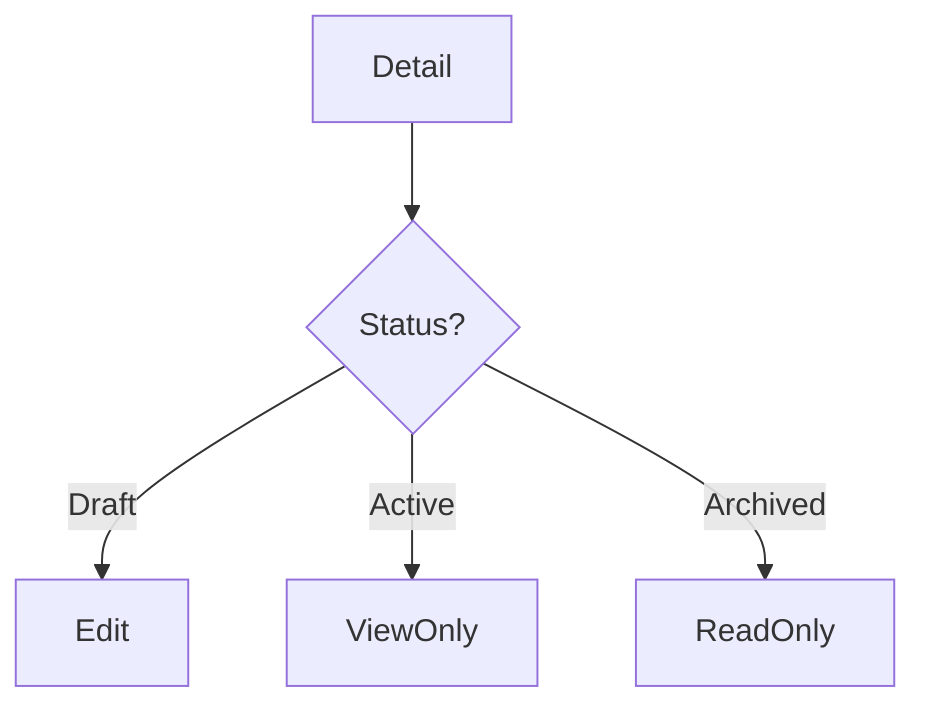

# 🖥️ screen-flow.md テンプレート

---

# 0️⃣ 設計前提

| 項目     | 内容                            |
| ------ | ----------------------------- |
| 対象ユーザー | 一般ユーザー / 管理者 / 未ログイン          |
| デバイス   | Desktop / Mobile / Responsive |
| 認証要否   | 公開ページあり / 全面認証制               |
| 権限制御   | RBAC / ABAC / なし              |
| MVP範囲  | P0画面のみ                        |

---

# 1️⃣ 画面一覧（Screen Inventory）

| ID   | 画面名     | 優先度 |
| ---- | ------- | --- |
| S-01 | タイトル画面  | P0  |
| S-02 | 設定画面    | P1  |
| S-03 | マッチング画面 | P0  |
| S-04 | ゲーム画面   | P0  |
| S-05 | ゲーム設定画面 | P1  |
| S-06 | リザルト画面  | P   |

---

# 2️⃣ 画面遷移図

---

# 3️⃣ ゲームフロー

---
