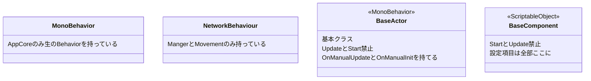
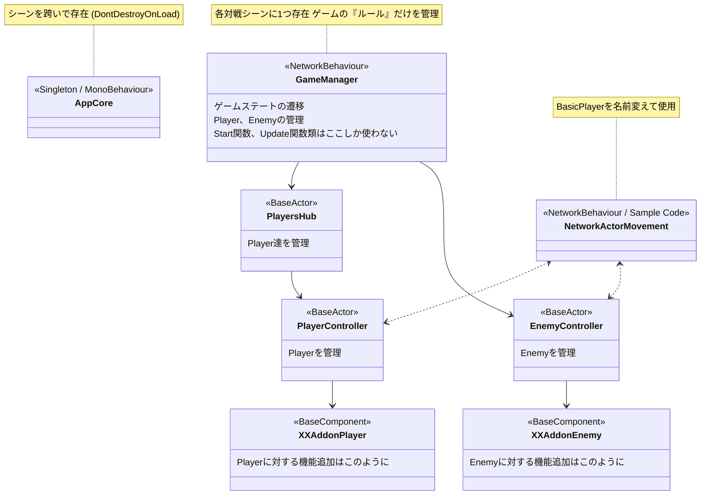

# 命名規則

関数・クラス　パスカルケース
変数　キャメルケース

# 名前法則

---
# 独自クラス継承

```mermaid
classDiagram
    class MonoBehavior {
        AppCoreのみ生のBehaviorを持っている
    }
    
    class NetworkBehaviour {
		MangerとMovementのみ持っている
    }
    
    class BaseActor {
	    <<MonoBehavior>>
		基本クラス
		UpdateとStart禁止
		OnManualUpdateとOnManualInitを持てる
    }
    
    class BaseComponent {
	    <<ScriptableObject>>
	    StartとUpdate禁止
	    設定項目は全部ここに
    }
```

---

# ゲーム画面参照関係

```mermaid
classDiagram
    %% --- 1. アプリ全体の基盤 ---
    class AppCore {
        <<Singleton / MonoBehaviour>>
    }
    note for AppCore "シーンを跨いで存在 (DontDestroyOnLoad)"

    %% --- 2. ネットワーク・ゲームロジック (Sync) ---
    class GameManager {
        <<NetworkBehaviour>>
        ゲームステートの遷移
        Player、Enemyの管理
        Start関数、Update関数類はここしか使わない
    }
    note for GameManager "各対戦シーンに1つ存在 ゲームの『ルール』だけを管理"
    
    class NetworkActorMovement {
        <<NetworkBehaviour / Sample Code>>
    }
    note for NetworkActorMovement "BasicPlayerを名前変えて使用"

    %% --- 3. プレイヤー実体 (Sample Based) ---
    class PlayersHub {
        <<BaseActor>>
        Player達を管理
    }
    
    class PlayerController {
        <<BaseActor>>
        Playerを管理
    }
    
    class XXAddonPlayer {
	    <<BaseComponent>>
	    Playerに対する機能追加はこのように
    }
    
    %% --- 4. Enemy実体 (Sample Based) ---
    class EnemyController {
        <<BaseActor>>
        Enemyを管理
    }
    
    class XXAddonEnemy {
	    <<BaseComponent>>
	    Enemyに対する機能追加はこのように
    }
    
    
    %% --- 参照 ---
    GameManager --> PlayersHub
    PlayersHub --> PlayerController
    NetworkActorMovement <..> PlayerController
    PlayerController --> XXAddonPlayer
    GameManager --> EnemyController
    NetworkActorMovement <..> EnemyController
    EnemyController --> XXAddonEnemy
```
