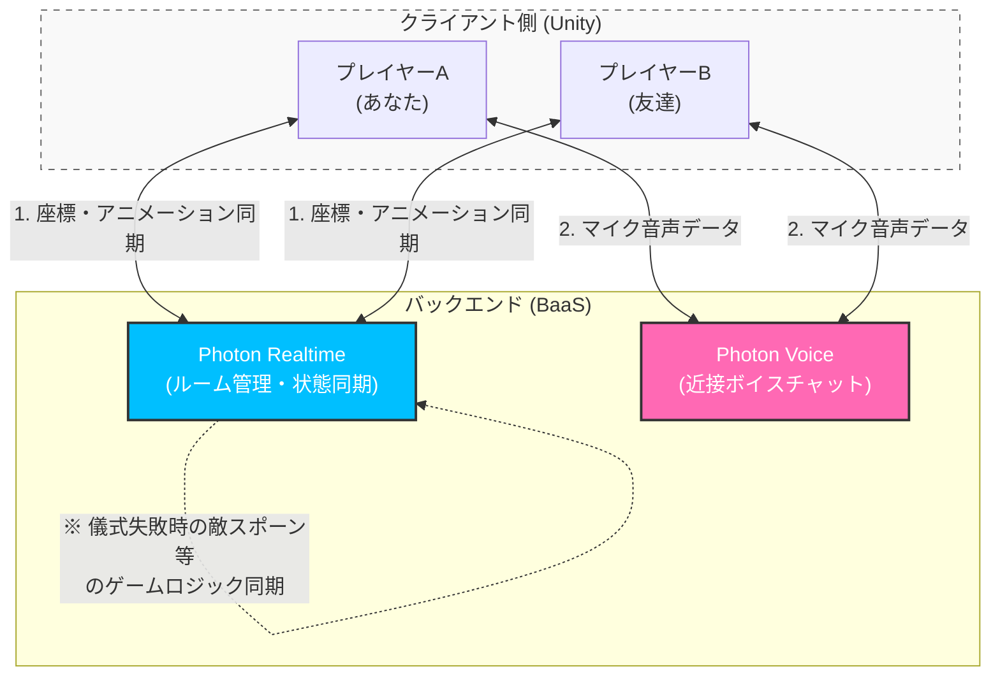

```mermaid
flowchart TD
    %% ノード定義
    subgraph Clients ["クライアント側 (Unity)"]
        Player1["プレイヤーA\n(あなた)"]
        Player2["プレイヤーB\n(友達)"]
    end

    subgraph Backend ["バックエンド (BaaS)"]
        PR["Photon Realtime\n(ルーム管理・状態同期)"]
        PV["Photon Voice\n(近接ボイスチャット)"]
    end

    %% 通信のやり取り
    Player1 <-->|"1. 座標・アニメーション同期"| PR
    Player2 <-->|"1. 座標・アニメーション同期"| PR

    Player1 <-->|"2. マイク音声データ"| PV
    Player2 <-->|"2. マイク音声データ"| PV

    PR -.->|"※ 儀式失敗時の敵スポーン等\nのゲームロジック同期"| PR

    %% スタイル（見栄え調整）
    style PR fill:#00bfff,stroke:#333,color:#fff,stroke-width:2px
    style PV fill:#ff69b4,stroke:#333,color:#fff,stroke-width:2px
    style Clients fill:#f9f9f9,stroke:#666,stroke-dasharray: 5 5
```
